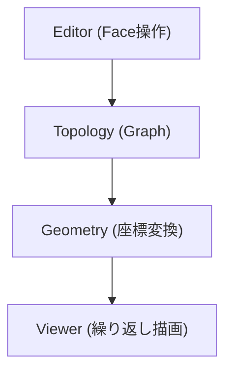
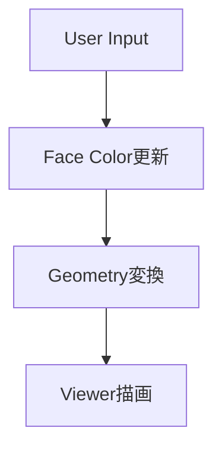

# MotifWeaver 設計書 - Overview

## 1. 目的

本アプリケーションは、敷き詰め模様を生成・編集・表示するためのツールである。

対象：

- 正三角形
- 正四角形
- 正六角形

---

## 2. アーキテクチャ

---

## 3. 設計方針

### 3.1 分離

- トポロジー（接続）
- 幾何（座標）
- 表示（描画）

を完全に分離する

---

### 3.2 基本原則

- 整数座標でトポロジーを管理
- 浮動小数点は描画のみ
- UIはFaceのみを扱う

---

## 4. データフロー

---

## 5. コンポーネント一覧

- Topology
- Geometry
- Editor
- Viewer

---