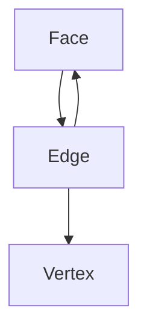

# Topology設計（強化版）

## 1. 概要

本モジュールはグラフ構造を定義する。

- Vertex（点）
- Edge（辺）
- Face（面）

---

## 2. 設計原則

- 完全な一意性（Vertex / Edge）
- 双方向参照を保持
- 幾何情報を持たない

---

## 3. Vertex

```csharp
class Vertex
{
    VertexKey Key;
    List<Edge> Edges;
}
```

---

## 4. Edge

```csharp
class Edge
{
    Vertex V1;
    Vertex V2;

    List<Face> Faces; // 隣接Face（最大2）
}
```

---

## 5. Face

```csharp
class Face
{
    List<Vertex> Vertices; // 時計回り（必須）
    List<Edge> Edges;

    Color Color;
}
```

---

## 6. 一意性保証

```csharp
Dictionary<VertexKey, Vertex> vertexMap;
Dictionary<EdgeKey, Edge> edgeMap;
```

---

## 7. 隣接関係API

```csharp
IEnumerable<Face> GetNeighbors(Face face)
{
    foreach (var edge in face.Edges)
        foreach (var f in edge.Faces)
            if (f != face)
                yield return f;
}
```

---

## 8. 構造図



---