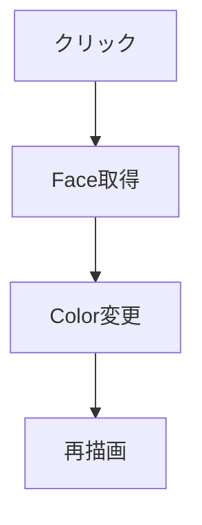

# Editor設計

## 1. モデル

```csharp
class GridModel
{
    List<Face> Faces;
}
```

---

## 2. 操作

```csharp
SetFaceColor(r, c, color)
```

---

## 3. フロー


```mermaid
flowchart TD
    A["クリック"] --> B["Face取得"]
    B --> C["Color変更"]
    C --> D["再描画"]
```

---

## 4. 方針

- Faceのみ操作
- トポロジーは不変

---