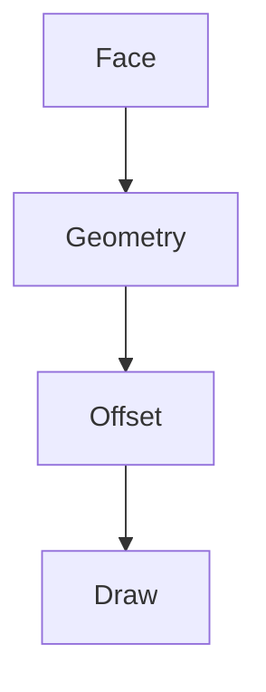

# Viewer設計（強化版）

## 1. 概要

有限パターンを周期的に描画する。

---

## 2. 描画フロー



---

## 3. タイル処理

```csharp
for ty in RepeatY:
    for tx in RepeatX:
        DrawTile(tx, ty)
```

---

## 4. オフセット

```csharp
offsetX = tx * tileWidth
offsetY = ty * tileHeight
```

---

## 5. 六角補正

```csharp
if (tx % 2 == 1)
    offsetY += tileHeight / 2
```

---

## 6. クリッピング

```csharp
if (!IsVisible(faceBounds))
    continue;
```

---

## 7. ズーム・パン

```csharp
screenX = (worldX + offsetX) * scale + panX
screenY = (worldY + offsetY) * scale + panY
```

---

## 8. 設計原則

- トポロジーは共有
- 描画のみ複製
- カメラ中心設計

---