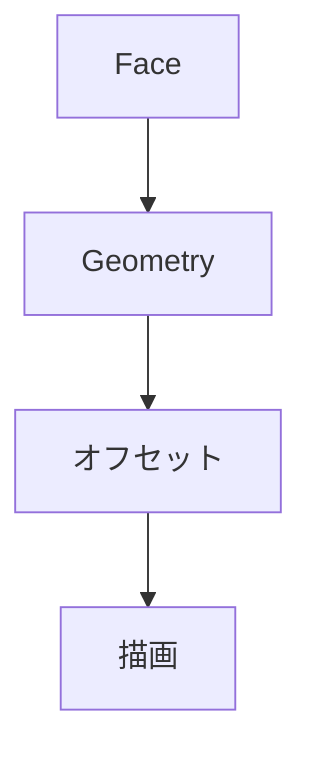

# Viewer設計

## 1. 概要

基本パターンを繰り返し描画する

---

## 2. フロー



---

## 3. タイル

```csharp
offsetX = tx * tileWidth
offsetY = ty * tileHeight
```

---

## 4. 六角形補正

```csharp
if (tx % 2 == 1)
    offsetY += tileHeight / 2;
```

---

## 5. 設計方針

- トポロジーは共有
- 描画のみ複製

---