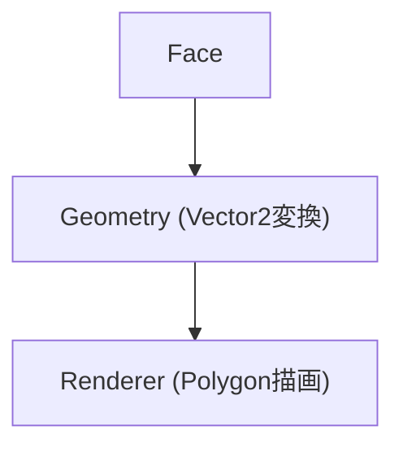

# Renderer設計（WPF / Blazor両対応）

## 1. 目的

本設計は、描画処理をUIフレームワークから分離し、  
以下の両方に対応可能な構造を実現することを目的とする：

- WPF（デスクトップアプリ）
- Blazor（Webアプリケーション）

---

## 2. 設計方針

### 2.1 責務分離

- Topology：構造管理
- Geometry：座標変換
- Renderer：描画

---

### 2.2 基本原則

- Rendererは「描画命令のみ」を扱う
- トポロジーを知らない
- Geometryに依存しない
- 副作用として描画する

---

## 3. 描画モデル



---

## 4. インターフェース定義

```csharp
public interface IRenderer
{
    void Begin();
    void DrawPolygon(IReadOnlyList<Vector2> points, Color color);
    void End();
}
```

---

### 4.1 各メソッドの役割

| メソッド | 内容 |
|--------|------|
| Begin | 描画フレーム開始 |
| DrawPolygon | ポリゴン描画 |
| End | 描画確定 |

---

## 5. 描画オーケストレーション

```csharp
public class RenderService
{
    private readonly IRenderer _renderer;
    private readonly IGridGeometry _geometry;

    public RenderService(IRenderer renderer, IGridGeometry geometry)
    {
        _renderer = renderer;
        _geometry = geometry;
    }

    public void Render(IEnumerable<Face> faces)
    {
        _renderer.Begin();

        foreach (var face in faces)
        {
            var points = face.Vertices
                .Select(v => _geometry.GetPosition(v))
                .ToList();

            _renderer.DrawPolygon(points, face.Color);
        }

        _renderer.End();
    }
}
```

---

## 6. WPF実装

```csharp
public class WpfRenderer : IRenderer
{
    private readonly Canvas _canvas;

    public WpfRenderer(Canvas canvas)
    {
        _canvas = canvas;
    }

    public void Begin()
    {
        _canvas.Children.Clear();
    }

    public void DrawPolygon(IReadOnlyList<Vector2> points, Color color)
    {
        var polygon = new Polygon
        {
            Fill = new SolidColorBrush(color)
        };

        foreach (var p in points)
        {
            polygon.Points.Add(new Point(p.X, p.Y));
        }

        _canvas.Children.Add(polygon);
    }

    public void End()
    {
    }
}
```

---

## 7. Blazor実装（SVG）

### 7.1 Renderer本体

```csharp
public class SvgRenderer : IRenderer
{
    private readonly List<string> _elements = new();

    public void Begin()
    {
        _elements.Clear();
    }

    public void DrawPolygon(IReadOnlyList<Vector2> points, Color color)
    {
        var pointsAttr = string.Join(" ",
            points.Select(p => $"{p.X},{p.Y}"));

        var colorStr = $"rgb({color.R},{color.G},{color.B})";

        _elements.Add(
            $"<polygon points=\"{pointsAttr}\" fill=\"{colorStr}\" />"
        );
    }

    public void End()
    {
    }

    public string GetSvgContent()
    {
        return string.Join("\n", _elements);
    }
}
```

---

### 7.2 Razor側

```html
<svg width="800" height="600">
    @((MarkupString)renderer.GetSvgContent())
</svg>
```

---

## 8. 設計制約

### 8.1 RendererはVector2のみ扱う

```text
NG: Vertexを扱う
OK: 座標のみ扱う
```

---

### 8.2 Faceを直接渡さない

```text
NG: DrawFace(Face)
OK: DrawPolygon(points, color)
```

---

### 8.3 Geometryと分離

- Rendererは座標変換しない
- Geometryの責務とする

---

## 9. 拡張設計

### 9.1 Edge描画

```csharp
void DrawLine(Vector2 p1, Vector2 p2, Color color);
```

---

### 9.2 アウトライン

```csharp
void DrawPolygonOutline(IReadOnlyList<Vector2> points, Color color);
```

---

## 10. パフォーマンス拡張

将来的な差し替え：

| 環境 | 実装 |
|------|------|
| WPF | DrawingVisual |
| Blazor | Canvas |

---

## 11. 設計の利点

- 描画ロジック完全分離
- フレームワーク依存排除
- 再利用性最大化
- テスト容易性向上

---

## 12. まとめ

本設計により：

- WPFとBlazorで描画層を差し替え可能
- トポロジー・ジオメトリは完全共通化
- 描画は「点列出力」という最小責務に限定

---

## 13. キーポイント

```text
描画は「データの最終出力」にすぎない
```
