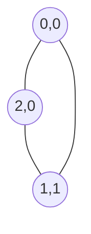
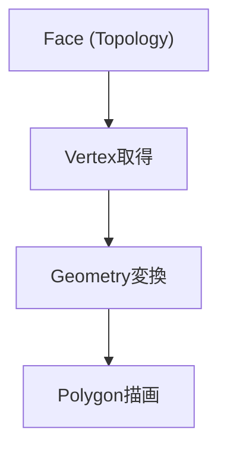

# MotifWeaver 設計書（Topology / Geometry 詳細設計）

## 1. 目的

本設計は、敷き詰め模様エディタにおける以下を定義する：

- 幾何学的図形（正三角形など）の敷き詰め構造
- Face / Edge / Vertex によるグラフ構造
- 整数座標によるトポロジー表現
- 描画座標への変換（Geometry）

---

## 2. 設計方針

### 2.1 トポロジーと幾何の分離

| 層 | 役割 |
|---|---|
| Topology | 接続関係（グラフ構造） |
| Geometry | 描画座標への変換 |
| Renderer | 実際の描画 |

---

### 2.2 基本原則

- 座標は**整数のみで管理**
- 浮動小数点は描画時のみ使用
- 重複排除は**キーによる完全一致**

---

## 3. データ構造

### 3.1 VertexKey

```csharp
public readonly struct VertexKey
{
    public int X { get; }
    public int Y { get; }

    public VertexKey(int x, int y)
    {
        X = x;
        Y = y;
    }
}
```

---

### 3.2 Vertex

```csharp
public class Vertex
{
    public VertexKey Key { get; }

    public Vertex(VertexKey key)
    {
        Key = key;
    }
}
```

---

### 3.3 EdgeKey

```csharp
public readonly struct EdgeKey
{
    public VertexKey A { get; }
    public VertexKey B { get; }

    public EdgeKey(VertexKey v1, VertexKey v2)
    {
        if (Compare(v1, v2) <= 0)
        {
            A = v1;
            B = v2;
        }
        else
        {
            A = v2;
            B = v1;
        }
    }

    private static int Compare(VertexKey v1, VertexKey v2)
    {
        int cmp = v1.X.CompareTo(v2.X);
        return cmp != 0 ? cmp : v1.Y.CompareTo(v2.Y);
    }
}
```

---

### 3.4 Edge

```csharp
public class Edge
{
    public Vertex V1 { get; }
    public Vertex V2 { get; }

    public Edge(Vertex v1, Vertex v2)
    {
        V1 = v1;
        V2 = v2;
    }
}
```

---

### 3.5 Face

```csharp
public class Face
{
    public IReadOnlyList<Edge> Edges { get; }

    public Color Color { get; set; }

    public Face(IEnumerable<Edge> edges)
    {
        Edges = edges.ToList();
    }
}
```

---

## 4. 重複排除の仕組み

### 4.1 Vertex

```csharp
Dictionary<VertexKey, Vertex> vertexMap;
```

- 同じキー → 同じインスタンス

---

### 4.2 Edge

```csharp
Dictionary<EdgeKey, Edge> edgeMap;
```

- (v1, v2) と (v2, v1) は同一
- Normalizeにより一意化

---

## 5. TriangleGridTopology

---

### 5.1 座標系（倍密度）

```text
baseX = 2 * c
baseY = r
isUp = (r + c) % 2 == 0
```

---

### 5.2 頂点定義

#### 上向き三角形

```text
v0 = (baseX,     baseY)
v1 = (baseX + 2, baseY)
v2 = (baseX + 1, baseY + 1)
```

#### 下向き三角形

```text
v0 = (baseX + 1, baseY + 1)
v1 = (baseX,     baseY + 2)
v2 = (baseX + 2, baseY + 2)
```

---

### 5.3 構造イメージ



---

### 5.4 実装

```csharp
public class TriangleGridTopology
{
    private readonly Dictionary<VertexKey, Vertex> _vertices = new();
    private readonly Dictionary<EdgeKey, Edge> _edges = new();

    public List<Face> Build(int rows, int cols)
    {
        var faces = new List<Face>();

        for (int r = 0; r < rows; r++)
        {
            for (int c = 0; c < cols; c++)
            {
                faces.Add(BuildFace(r, c));
            }
        }

        return faces;
    }

    private Face BuildFace(int r, int c)
    {
        int baseX = 2 * c;
        int baseY = r;
        bool isUp = (r + c) % 2 == 0;

        VertexKey v0, v1, v2;

        if (isUp)
        {
            v0 = new(baseX, baseY);
            v1 = new(baseX + 2, baseY);
            v2 = new(baseX + 1, baseY + 1);
        }
        else
        {
            v0 = new(baseX + 1, baseY + 1);
            v1 = new(baseX, baseY + 2);
            v2 = new(baseX + 2, baseY + 2);
        }

        var e1 = GetOrCreateEdge(v0, v1);
        var e2 = GetOrCreateEdge(v1, v2);
        var e3 = GetOrCreateEdge(v2, v0);

        return new Face(new[] { e1, e2, e3 });
    }

    private Vertex GetOrCreateVertex(VertexKey key)
    {
        if (!_vertices.TryGetValue(key, out var v))
        {
            v = new Vertex(key);
            _vertices[key] = v;
        }
        return v;
    }

    private Edge GetOrCreateEdge(VertexKey a, VertexKey b)
    {
        var key = new EdgeKey(a, b);

        if (!_edges.TryGetValue(key, out var e))
        {
            e = new Edge(GetOrCreateVertex(a), GetOrCreateVertex(b));
            _edges[key] = e;
        }

        return e;
    }
}
```

---

## 6. Geometry（描画変換）

---

### 6.1 変換式

```text
screenX = (X / 2) * w
screenY = Y * (√3 / 2) * w
```

---

### 6.2 実装

```csharp
public class TriangleGridGeometry
{
    private readonly double _w;
    private readonly double _h;

    public TriangleGridGeometry(double edgeLength)
    {
        _w = edgeLength;
        _h = Math.Sqrt(3) / 2 * edgeLength;
    }

    public Vector2 GetPosition(Vertex v)
    {
        var k = v.Key;

        double x = (k.X / 2.0) * _w;
        double y = k.Y * _h;

        return new Vector2((float)x, (float)y);
    }
}
```

---

## 7. 描画フロー



---

## 8. 設計の特徴

### 8.1 メリット

- 完全な重複排除（Vertex / Edge）
- 浮動小数点誤差なし
- グラフ構造が明確
- 経路探索に直結

---

### 8.2 拡張性

- Edgeに色付け可能
- 経路探索（オイラー路）に対応
- 六角形グリッドへ拡張可能

---

## 9. 今後の拡張

- HexGridTopology
- SquareGridTopology
- Edgeカラーリング戦略
- 経路探索アルゴリズム
- 無限タイリング対応

---

## 10. まとめ

本設計では：

- トポロジーを整数グラフとして定義
- Geometryで見た目を復元
- Face中心のUIとEdge中心の拡張を両立

これにより、シンプルかつ拡張性の高い構造を実現する。